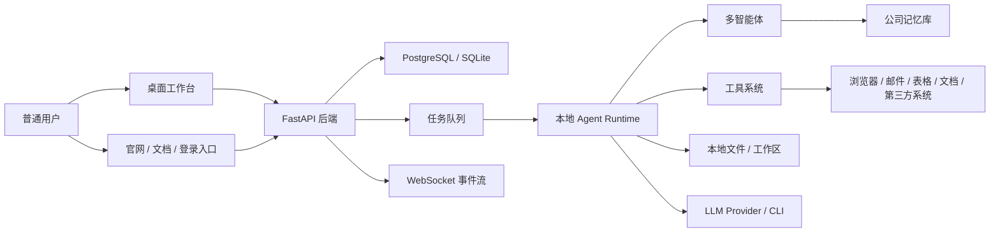

# AgentPulse

AgentPulse 是一个面向普通人和一人公司的 AI 公司工作台。它的目标不是再做一个聊天机器人，而是让用户像搭建一支小团队一样，创建 AI 员工、分配任务、连接工具和资料库，让多个智能体协作完成内容、销售、客服、运营、财务和项目管理等日常工作。

当前仓库已经初始化为一个 monorepo，包含官网、桌面应用和 Python 后端三个脚手架。后续会在这个基础上继续演进出“多智能体协作 + 本地执行环境 + 实时任务流”的产品形态。

## 产品方向

AgentPulse 希望解决的问题是：一个没有技术背景的用户，也能把自己的业务目标交给 AI 团队，并且看得懂、管得住、改得动。

核心体验会围绕四件事展开：

- **搭公司**：用户先描述自己的业务，例如自媒体工作室、跨境小店、咨询服务、知识付费项目。
- **雇员工**：系统根据业务自动推荐 AI 角色，例如老板助理、内容策划、销售跟进、客服、财务整理、数据分析。
- **派任务**：用户用自然语言说目标，系统拆解成任务流，由不同智能体接力完成。
- **看进度**：每个智能体做了什么、用了什么资料、产出了什么结果、哪些动作需要用户确认，都用可视化方式呈现。

## 设计参考

本项目参考了 Multica 的核心思想，但会面向普通用户做更强的产品抽象。

Multica 的关键模式可以概括为：

- 用户创建 issue/task。
- 后端把任务放进队列。
- 本地 daemon 领取任务并创建隔离工作区。
- agent runtime 调用 Codex、Claude 等 provider 执行任务。
- 执行过程通过 WebSocket 回传给前端。
- 前端把任务、消息、文件变更和结果统一展示出来。

AgentPulse 会吸收这个“任务队列 + 本地运行时 + 多智能体协作 + 实时反馈”的架构，但不会把复杂概念直接暴露给普通用户。用户看到的是“公司、员工、任务、客户、内容、项目、文件、审批”，底层再映射到 agent、tool、memory、run、event 等技术对象。

## 当前模块

```text
agentpulse/
  apps/
    web/              # 官网，Vite + React + TypeScript
    desktop/          # 桌面应用，Electron + Vite + React + TypeScript
  services/
    api/              # 后端 API，FastAPI
```

### `apps/web`

官网项目，用于展示产品定位、使用场景、早期访问入口和后续的文档/案例页面。

技术栈：

- Vite
- React
- TypeScript
- lucide-react

### `apps/desktop`

桌面应用项目，未来会成为主工作台。桌面端适合承载本地文件访问、浏览器自动化、本地模型/CLI 调用、任务运行状态展示等能力。

技术栈：

- Electron
- Vite
- React
- TypeScript
- lucide-react

### `services/api`

Python 后端服务，当前提供基础健康检查。后续会承载工作区、智能体、任务、消息、工具、记忆和运行记录等核心 API。

技术栈：

- FastAPI
- Pydantic Settings
- Uvicorn
- Pytest

## 目标架构



建议的后端领域模块：

- `workspaces`：一人公司/业务空间。
- `agents`：AI 员工角色、能力、提示词、可用工具。
- `tasks`：任务、子任务、状态机、优先级、负责人。
- `runs`：一次 agent 执行记录、步骤、日志、产出。
- `messages`：用户、系统、agent 之间的对话和事件。
- `tools`：文件、浏览器、搜索、表格、邮件等工具定义和授权。
- `memory`：长期业务资料、品牌语气、客户信息、项目背景。
- `templates`：行业模板、智能体模板、任务模板、工作流模板。

## 任务生命周期

第一版可以采用较简单的状态机：

```text
queued -> assigned -> running -> waiting_user -> completed
                         |              |
                         v              v
                       failed        cancelled
```

典型流程：

1. 用户输入目标，例如“帮我做一个小红书账号的一周内容计划”。
2. Boss Agent 把目标拆成多个子任务。
3. Planner Agent 负责调研和规划。
4. Writer Agent 负责生成内容。
5. Reviewer Agent 检查质量、风险和风格一致性。
6. 用户在关键节点确认，例如是否发布、是否发送邮件、是否修改文件。
7. 系统沉淀结果到任务记录和公司记忆库。

## MVP 范围

建议先做一个垂直闭环，而不是一开始做全行业通用平台。

第一阶段可以选择“一人自媒体公司”作为 MVP 场景：

- 创建一个公司工作区。
- 自动生成 3 个 AI 员工：老板助理、内容策划、运营执行。
- 用户输入一个业务目标。
- 系统自动拆解任务并分配给智能体。
- 前端实时显示每个智能体的执行过程。
- 支持生成 Markdown、表格和本地文件。
- 对外部动作设置人工确认，例如发布内容、发送邮件、修改重要文件。

## 本地开发

### 环境要求

- Node.js 20+
- npm 10+
- Python 3.12+

仓库内包含 `.npmrc`，已配置 npm 镜像和 Electron binary 镜像，方便在国内网络环境安装依赖。

### 安装 Node 依赖

```bash
npm install
```

### 安装 Python 依赖

```bash
cd services/api
python3 -m venv .venv
source .venv/bin/activate
pip install -r requirements.txt
```

### 启动官网

```bash
npm run dev:web
```

默认访问地址：

```text
http://localhost:5173
```

### 启动桌面应用

```bash
npm run dev:desktop
```

桌面端会打开一个 Electron 窗口，底层 Vite dev server 默认运行在：

```text
http://localhost:5174
```

### 启动后端 API

```bash
npm run dev:api
```

默认访问地址：

```text
http://localhost:8000
```

健康检查：

```text
http://localhost:8000/api/health
```

## 常用命令

```bash
npm run build       # 构建 web 和 desktop
npm run lint        # TypeScript 类型检查
npm run format      # Prettier 格式化
npm run test:api    # 运行 FastAPI 测试
```

## 开发路线图

### Phase 1：基础产品骨架

- 完成官网首屏和产品介绍。
- 完成桌面端工作台基础布局。
- 完成 FastAPI 基础模块拆分。
- 建立 workspace、agent、task、message 的数据模型。
- 建立任务详情页和执行日志流。

### Phase 2：多智能体任务闭环

- 实现 Boss Agent 的任务拆解。
- 实现任务队列和任务状态机。
- 实现 agent run 记录。
- 实现 WebSocket 实时进度推送。
- 加入用户确认节点。

### Phase 3：本地运行时

- 在桌面端管理本地 agent runtime。
- 支持隔离任务工作目录。
- 支持本地文件读写工具。
- 支持网页搜索、Markdown 导出和表格导出。
- 支持接入不同 LLM provider。

### Phase 4：普通用户可用

- 行业模板和智能体模板。
- 可视化智能体配置。
- 公司记忆库。
- 权限和风险控制。
- 工作结果归档、复用和复盘。

## 核心原则

- 面向普通人，不把 prompt、JSON schema、workflow DAG 直接丢给用户。
- 桌面端优先，因为本地文件、浏览器和个人工作环境是关键生产力入口。
- 所有高风险动作都要可见、可追踪、可确认。
- 先做垂直场景闭环，再扩展成通用平台。
- 多智能体不是卖点本身，真正的卖点是让一个人能稳定完成一家小公司的工作。
