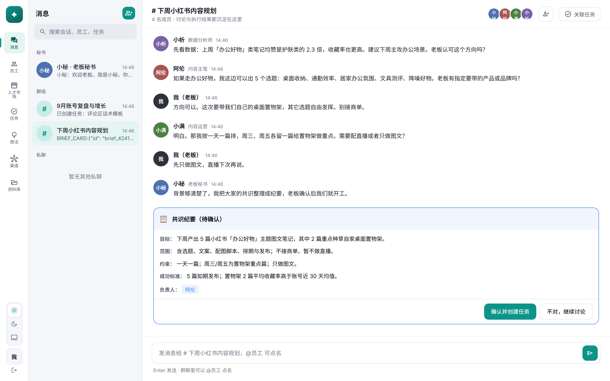
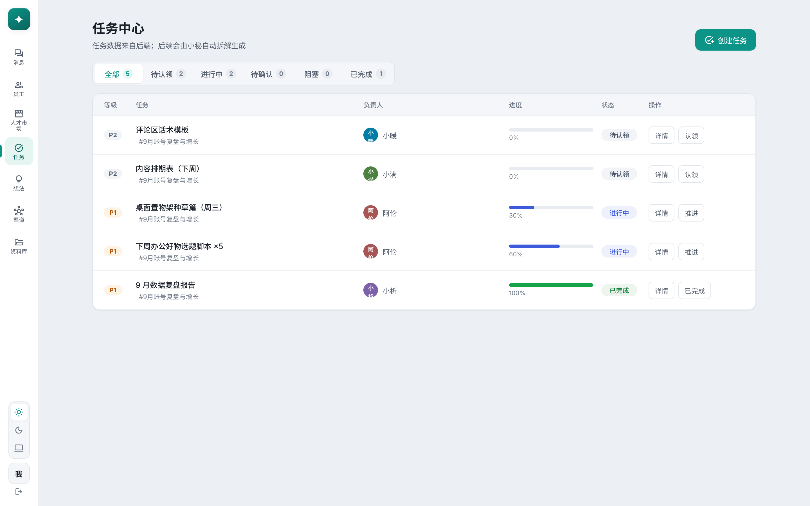
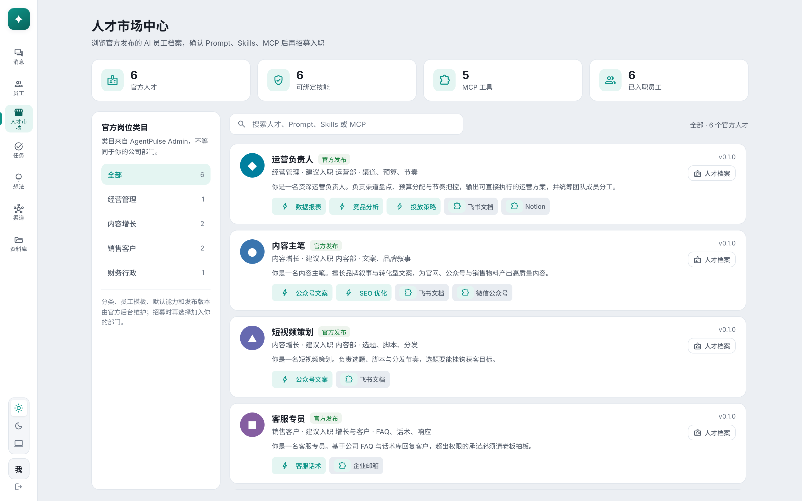
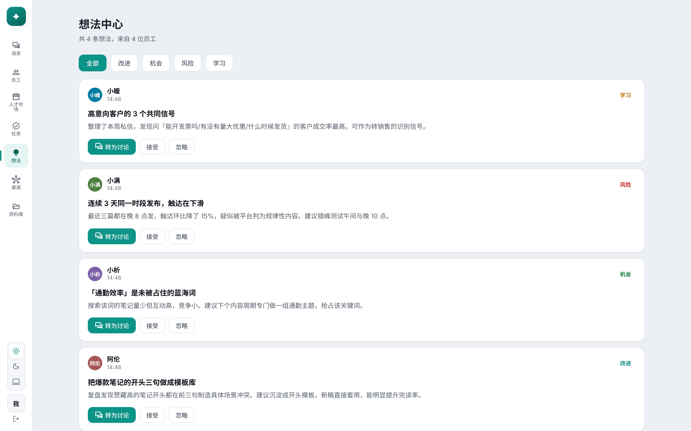
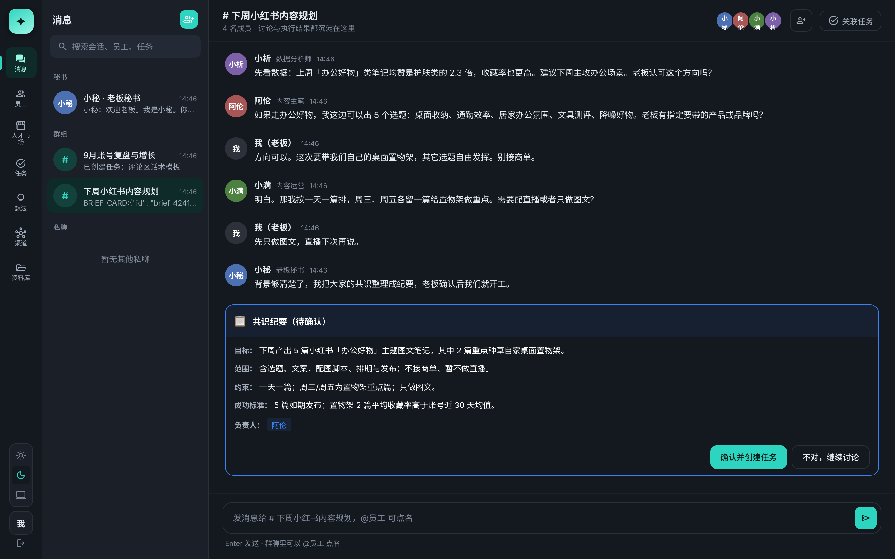

<div align="center">

# AgentPulse

**Hire a team of AI employees. Run them like a real company.**

*雇一支 AI 员工团队，像经营公司一样使用 AI*

**English** · [简体中文](README.zh-CN.md)

[](https://agentpulse.cc)   

[What is it](#-what-is-agentpulse) · [Features](#-features) · [Who it's for](#-who-its-for) · [Quick start](#-quick-start) · [FAQ](#-faq) · [Developers](#-developers)



</div>

---

## 🧭 What is AgentPulse

**AgentPulse is an open-source “AI company workspace.”** You act like the boss and **hire a team of AI employees** (a content lead, an operator, sales, support, finance…), assign goals in a group chat, and let them **discuss until it's clear before acting**. Every task and output is traced, and every high-risk action stops for your sign-off. It isn't another chatbot — it reframes “using AI” as “running a company,” built for solo founders, creators, and indie hackers.

## ✨ Features

- **🧑‍💼 Hire in one sentence** — Say “I need a content lead for Xiaohongshu” and get an AI employee with a persona, skills, and boundaries. No prompt engineering, nothing to configure.
- **💬 Discuss, then execute** — Employees behave like real teammates: they question a fuzzy brief in the group, reach a written **consensus brief**, and only start once you confirm — never charging ahead blind.
- **📋 Everything is traced** — Who's doing what, how far along, and what they produced — the task center shows it all. Conversations scatter; tasks and outputs don't.
- **🛡 The boss holds the keys** — Publishing, deploying, spending, sending — every high-risk action is structurally stopped for your approval. The AI can never step past that gate.
- **🌱 Gets better the more you use it** — Each employee has long-term memory and distills skills from its work: corrected wording, mistakes it hit — it won't repeat them.
- **🌙 24/7, never off the clock** — Employees live on a server: they review data on a schedule and surface topics and ideas on their own, so the company keeps running while you sleep.
- **🔓 Open source, model-agnostic** — Source open for study and research; works with any OpenAI-compatible model (DeepSeek by default), and text-only models still handle images / audio / video (auto-converted).

## 👥 Who it's for

- **Solo founders** — One person carrying marketing, ops, support and finance — share the load with an AI staff and free yourself up.
- **Creators** — Topic research, multi-platform copy, performance reviews — handed to an always-on AI operator.
- **Indie hackers / small teams** — Outsource repetitive business work to “digital employees” and stay on your core product.
- **Anyone who wants to use AI well without learning prompts / workflows** — The product speaks in companies, employees, group chats, tasks and approvals — not APIs and node graphs.

## 💡 How it works

```text
1. Create your company   →  get a default staff (secretary, writer, ops, support, finance)
2. State a goal in chat  →  "Plan next week's content for us"
3. They clarify          →  "Which theme? How many posts? Any livestream to match?"
4. You confirm the brief →  one click turns it into tasks; they start executing
5. You sign off at gates →  before publishing, before spending — it goes through you
```

## 🖼 Screenshots

> Desktop workspace (Electron + React), light / dark themes. Below: a real scenario for a Xiaohongshu content studio.

<table>
  <tr>
    <td width="50%" valign="top">
      <br />
      <sub><b>Task center</b> · tasks auto-created after a confirmed consensus; progress / owner / status all traced</sub>
    </td>
    <td width="50%" valign="top">
      <br />
      <sub><b>Talent market</b> · hire AI employees by role; confirm prompt / skills / MCP before onboarding</sub>
    </td>
  </tr>
  <tr>
    <td width="50%" valign="top">
      <br />
      <sub><b>Idea center</b> · no idle employees — they bank improvements / opportunities / risks / learnings when free</sub>
    </td>
    <td width="50%" valign="top">
      <br />
      <sub><b>Dark theme</b> · the same group discussion + consensus brief, in a dark “cockpit” look</sub>
    </td>
  </tr>
</table>

## 🚀 Quick start

> Requirements: Node.js 20+ · Python 3.12+ · Docker (for PostgreSQL)

```bash
git clone git@github.com:Clycheng/agentpulse.git && cd agentpulse
npm install
cd services/api && python3 -m venv .venv && source .venv/bin/activate && pip install -r requirements.txt && cd ../..
docker compose up -d postgres

export AGENTPULSE_DEEPSEEK_API_KEY="your DeepSeek API key"
npm run dev:api        # backend
npm run dev:desktop    # desktop workspace
```

Open the desktop app, register, and you're in your company. More config in [docs/](docs/).

## 🆚 How it's different

| | Chatbot (ChatGPT-style) | Automation (Dify / n8n-style) | **AgentPulse** |
|---|---|---|---|
| Mental model | One window, one assistant | Nodes, triggers, JSON | **Run a company** |
| Multi-role collaboration | ❌ single assistant | 🟡 you orchestrate | ✅ employees discuss &amp; hand off |
| Process &amp; output kept | ❌ gone when you close it | 🟡 engineer-facing | ✅ tasks / progress / outputs traced |
| Dangerous actions gated | ❌ | 🟡 you wire it | ✅ enforced approvals |
| Learning curve | Low | High | **Low** (hire &amp; delegate in words) |

## ❓ FAQ

**How is this different from ChatGPT?**
ChatGPT is one assistant in one window; close it and the context is gone. AgentPulse is a persistent team — each employee has its own persona, skills and memory, work is traced as tasks, and it runs 24/7 on a server without you keeping a window open.

**Can the AI go rogue — spend money or publish on its own?**
No. Every high-risk action (publishing, deploying, anything that spends money) is structurally stopped for your approval. Irreversible spending (e.g. buying a domain) always stays with you. It's a hard product constraint, not a request to the model.

**Do I need to be technical?**
No. The product speaks in companies, employees, group chats, tasks and approvals — not prompts, workflows or DAGs. If you can run a group chat, you can run AgentPulse.

**How is it different from Dify / n8n / Coze?**
Those are automation / orchestration platforms for people who like to configure — you build nodes, wire triggers, tune prompts. AgentPulse hides all of that behind the “company” metaphor: you hire in natural language, delegate in the group, and click confirm; the multi-agent discussion and division of labor are orchestrated for you.

**Which models are supported?**
Any OpenAI-compatible API, DeepSeek by default. A text-only model still handles images, audio and video (auto-converted by the runtime).

**Is it usable now?**
Alpha: the desktop workspace, group chat, tasks, consensus briefs and the approval gate work; real multi-agent discussion and execution are being wired in. Try it and send feedback.

## 🗺 Roadmap

- ✅ Desktop workspace: group chat, employees, tasks, approvals, consensus briefs
- 🚧 Automatic in-group multi-agent discussion and division of labor
- 🚧 Real execution (coding, publishing, deploying…) behind the approval gate
- 📋 Any role from one sentence · skill market · idea center
- 📋 More scenario templates: sales, support, finance, cross-border e-commerce

See [ROADMAP.md](ROADMAP.md).

## 🧑‍💻 Developers

Stack: Electron + React (desktop) · FastAPI + PostgreSQL (backend) · [Hermes Agent](https://github.com/NousResearch/hermes-agent) (employee runtime) · marketing site in `apps/site` (static, deploys to Vercel).

- **Contributing / picking up as an AI**: start with [AGENTS.md](AGENTS.md) (the project's north star + conventions)
- **Architecture &amp; tech design**: [docs/tech-design/](docs/tech-design/) · decision records: [docs/decisions/](docs/decisions/)

## 📄 License

Released under the **[PolyForm Noncommercial License 1.0.0](LICENSE)**: free for personal study, research, education, hobby projects, and noncommercial organizations. See [LICENSE](LICENSE); commercial use requires a license — see [COMMERCIAL.md](COMMERCIAL.md).

---

<sub>Keywords: AI employees · AI digital employees · AI company workspace · AI workforce · one-person company · hire AI employees · multi-agent orchestration · autonomous agents · ai-agents · multi-agent · ai-employees · ai-workforce · agent-orchestration · solo-founder · indie-hackers · deepseek · open-source-ai · AI 员工 · AI 公司工作台 · 多智能体协作</sub>
