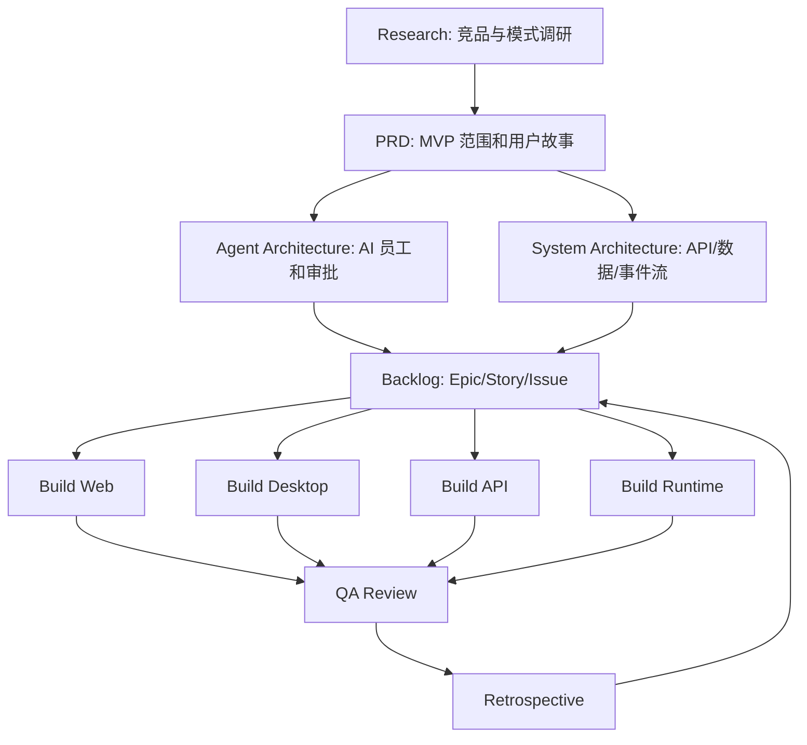

# AgentPulse 第一阶段闭环工作流

本文定义 AgentPulse 第一阶段的研发闭环：先调研，再定义需求，再拆分任务，再分配研发，再 QA 验收，再复盘进入下一轮 backlog。第一阶段只服务“一人自媒体公司”MVP，不把平台能力提前扩展成全行业通用系统。

## 目标

- 让项目像 Jira 一样可追踪：Backlog -> Todo -> In Progress -> Review -> Done。
- 避免需求、架构和验收标准不清时提前开工。
- 把产品愿景、调研、架构设计转成可执行 issue。
- 建立高风险动作的用户确认节点。
- 把 AgentPulse 自己的研发方式沉淀成产品内未来可复用的“公司工作流”。

## 阶段流转

```text
Research -> PRD -> Architecture -> Backlog -> Build -> QA -> Retrospective
```

| 阶段          | 主要产出                                         | 负责人                                                     | 进入下一阶段的门槛                                                 |
| ------------- | ------------------------------------------------ | ---------------------------------------------------------- | ------------------------------------------------------------------ |
| Research      | 竞品/模式调研、可借鉴点、不做清单                | agentpulse-researcher / Research Squad                    | 调研来源清楚，结论能转化为产品或架构决策                           |
| PRD           | MVP 范围、用户故事、优先级、非目标               | agentpulse-product-strategist，Founder 最终把关           | 范围聚焦一人自媒体公司，用户场景和成功标准明确                     |
| Architecture  | agent 体系、任务状态、API/数据模型、runtime 边界 | agentpulse-agent-architect / agentpulse-system-architect | 关键技术边界、依赖、风险和确认节点明确                             |
| Backlog       | Epic/Story/Task、验收标准、依赖图、assignee 建议 | agentpulse-backlog-manager                                | 每个 issue 有背景、目标、范围、验收标准、依赖、风险、建议 assignee |
| Build         | 代码、文档、原型、测试                           | 具体研发 agent                                             | issue 进入 Todo，且研发启动门槛全部满足                            |
| QA            | 测试报告、代码 review、风险清单、验收意见        | agentpulse-qa-reviewer                                    | lint/build/test 或替代验证完成，风险已记录                         |
| Retrospective | 复盘、流程改进、下一轮 backlog                   | agentpulse-program-manager                                | 发现的问题已转成新 issue 或明确暂不处理                            |

## 研发启动门槛

任何研发 issue 从 Backlog 提升到 Todo 前，必须满足以下条件：

1. 背景清楚：说明为什么现在要做，关联哪个 MVP 用户场景。
2. 目标清楚：说明用户或系统完成后能得到什么。
3. 范围清楚：列出本次做什么、不做什么。
4. 验收标准清楚：至少包含功能行为、可视/接口结果、测试或验证方式。
5. 依赖清楚：标注是否依赖 PRD、架构、设计、接口、数据模型或其他 issue。
6. 风险清楚：标注数据、权限、发布、外部动作、隐私、成本等风险。
7. Assignee 清楚：直接分配给具体 agent；跨域协调才分配给 squad leader。
8. 用户确认节点清楚：涉及发布内容、发送邮件、修改重要文件、连接外部账号、删除数据、计费等动作，必须先设计确认流程。

不满足门槛的任务保持 Backlog，由 Planning Squad 补齐信息，不进入研发。

## 状态规则

| 状态        | 含义           | 使用规则                                            |
| ----------- | -------------- | --------------------------------------------------- |
| Backlog     | 已记录但不启动 | 缺依赖、缺验收标准或计划后续阶段做                  |
| Todo        | 可以启动       | 已满足研发启动门槛；agent-assigned issue 会触发执行 |
| In Progress | 正在执行       | assignee 已开始实现或调研                           |
| Review      | 等待验收       | 代码/文档已交付，交给 QA 或上游 reviewer            |
| Done        | 已验收完成     | 验收标准通过，风险已记录                            |
| Blocked     | 被阻塞         | 必须说明 blocked_reason 和 waiting_on               |
| Cancelled   | 明确不做       | 必须说明取消原因                                    |

## Squad 不自动 fan-out 的 workaround

当前 Multica Squad 是协调对象，不是执行队列。把 issue 分配给 squad 或 mention squad 时，只会路由给 squad 的 leader，不会自动把任务派发给所有成员。因此第一阶段采用以下 workaround：

1. 规划类任务可以分配给 Planning Squad，由 leader 协调和拆分。
2. 调研类任务可以分配给 Research Squad，由 leader 汇总研究结论。
3. 研发类任务不要只分配给 Builder Squad；应创建子 issue，直接分配给具体 agent。
4. 严格串行任务使用 stage：Stage 1 的子 issue 设为 Todo，后续 stage 设为 Backlog，等上游完成后再提升。
5. 可并行任务放在同一 stage，并全部设为 Todo。
6. Program Manager 或 Backlog Manager 负责阶段推进，不依赖 squad 自动 fan-out。

推荐分配方式：

| 任务类型                         | 推荐 assignee                  |
| -------------------------------- | ------------------------------ |
| 产品愿景、MVP 取舍、最终验收     | agentpulse-founder            |
| PRD、用户故事、优先级            | agentpulse-product-strategist |
| 多智能体角色、handoff、审批      | agentpulse-agent-architect    |
| 后端架构、数据模型、API、事件流  | agentpulse-system-architect   |
| FastAPI 实现和测试               | agentpulse-backend-engineer   |
| Electron 桌面工作台              | agentpulse-desktop-engineer   |
| 官网和对外展示页                 | agentpulse-web-engineer       |
| 本地 runtime、工具接口、provider | agentpulse-runtime-engineer   |
| 新手引导、空状态、产品文案       | agentpulse-ux-writer          |
| QA、代码审查、风险控制           | agentpulse-qa-reviewer        |
| 任务拆解、依赖、排期、验收标准   | agentpulse-backlog-manager    |
| 跨域协调、阶段推进、复盘         | agentpulse-program-manager    |

## QA/复盘闭环

每个研发 issue 进入 Review 后，必须经过 QA 闭环：

1. Assignee 提交结果：说明改了什么、为什么、如何验证、风险和下一步。
2. QA Reviewer 验收：运行适用命令，优先包括 `npm run lint`、`npm run build`、`npm run test:api`。
3. QA 检查验收标准：逐条标注通过、失败或未覆盖。
4. QA 检查高风险动作：确认外部发送、发布、删除、授权、修改重要文件等行为是否有用户确认节点。
5. 发现问题时：创建或建议 follow-up issue，不在同一个 issue 中无限扩大范围。
6. 通过后：issue 才能进入 Done。
7. Program Manager 复盘：把重复问题、缺失标准、架构债务转成下一轮 backlog。

如果某个验证命令无法运行，必须说明原因和替代验证方式。

## 阶段依赖图



## 第一阶段验收口径

第一阶段完成不等于平台完整通用化，而是满足以下 MVP 闭环：

- 用户能理解 AgentPulse 是“一人自媒体公司”的 AI 工作台。
- 用户能创建或看到一个公司工作区。
- 系统提供至少 3 个 AI 员工：老板助理、内容策划、运营执行。
- 用户能提交一个内容生产目标。
- 系统能拆解任务、展示负责人、状态和产出。
- 关键外部动作必须等待用户确认。
- QA 能复现流程并看到日志、状态和结果。
- 复盘能沉淀问题并进入下一轮 backlog。
